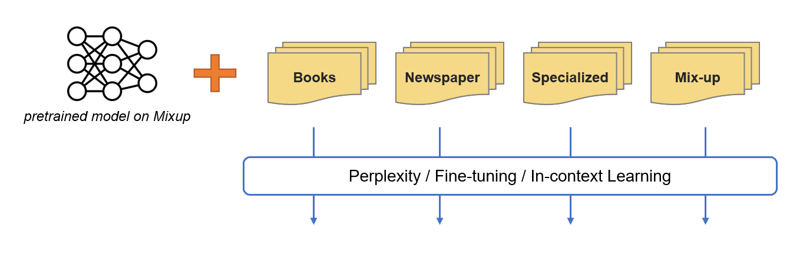

# Exploring the Impact of Pretraining Corpora
This repository provides scripts and source codes of our NLP project, **"Exploring the Impact of Pretraining Corpora: Language Modeling and Downstream tasks"** by **Team 3**.

## Directory Trees
```
.
├── corpus_construction   # codes for corpus contruction 
├── finetune              # codes for finetuning
├── in-context            # codes for in-context learning
├── perplexity            # codes for measuring perplexity
├── pretrain              # codes for pretraining language models
└── scripts               # scripts for training and preprocessing 
```

## Proposal Idea 1

To investigate the effect of corpora to the model capability, we pretrain models on different corpus domain and evaluate each model using intrinsic/extrinsic evaluation.


1. Prepare corpora from different domains
    - [/corpus_construction](./corpus_construction/)
2. Pretrain a model on each corpus
    - [/pretrain](./pretrain/)
3. Evaluate perplexity, fine-tuning, and in-context learning performance
    - [/perplexity](./perplexity/)
    - [/finetune](./finetune/)
    - [/in-context](./in-context/)
4. Compare the performance

You can check details in each directories' `README.md` file.

## Proposal Idea 2

We also try additional re-training of using different corpus domain to improve downstream tasks.



This experiments also use same directories as above.